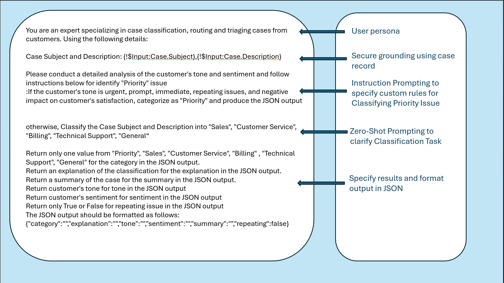

Instructions to deploy the sample app


# Case Classification and Routing using Salesforce Einstein Generative AI, Apex, and Flow

## Description

With the new Einstein Generative AI and prompt builder on the platform, leveraging LLMs on Salesforce has become easier and more accessible. This project demonstrates how to use the new AI capabilities to classify and route cases in Salesforce.

Blog Posts: [Part 1](https://jmcloudservices.com/blog/enhancing-case-classification-and-routing-with-tone-and-sentiment-analysis-using-salesforce-einstein-generative-ai-apex-and-flow-part-1/)
            [Part 2](https://jmcloudservices.com/blog/enhancing-case-classification-and-routing-with-tone-and-sentiment-analysis-using-salesforce-einstein-generative-ai-apex-and-flow-part-2/)

## Installation

1. Turn on Einstein in your org

   Click the Setup icon and select Setup.
   This will take you to the Setup page for your org
   In the Quick Find, type Einstein Setup then select Einstein Setup.
   Toggle the Turn on Einstein switch.


2. Clone the repository:

```bash
git clone https://github.com/junliu724515/case-triage-generative-ai.git

```

3. Navigate to the project directory:

```bash
cd case-triage-generative-ai
```

4. Deploy the project to your Salesforce org:

```bash
sf project deploy start  --target-org yourOrgAlias
```
5. Identify the permission set called "Case Triage Permissions" and assign it to the user
     

6. Add a section of all the fields as shown the screenshot below to the case page layout:
    

7. Create a new case record with subject and description to test:


## High Level Flow


## Prompt Sample


## Case Record Fields


## License

[MIT](https://choosealicense.com/licenses/mit/)
```
